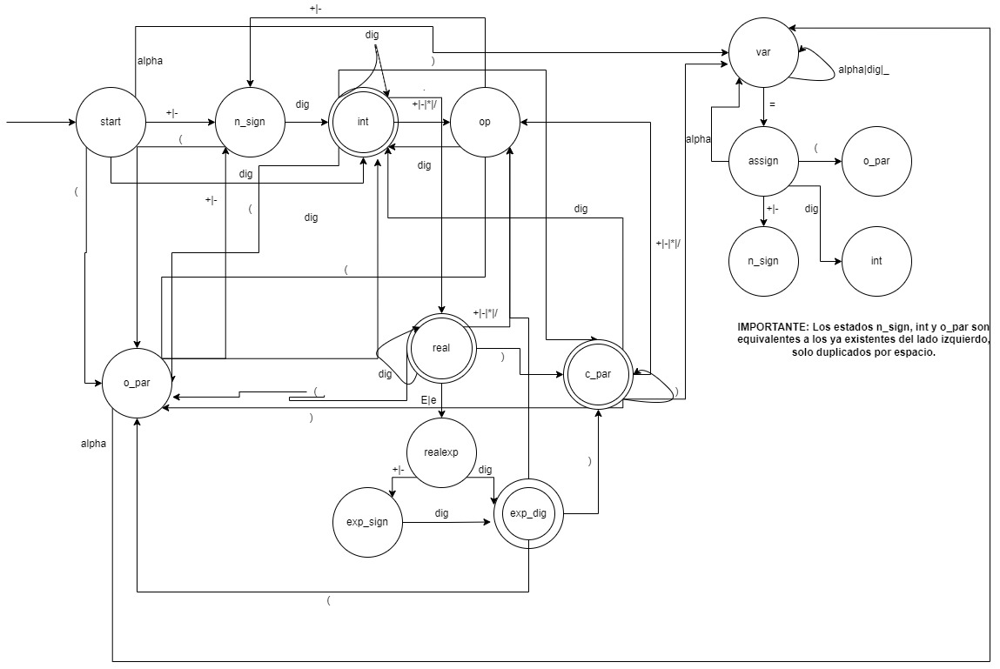

# Actividad 3.2: Programando un DFA
### Jacobo Soffer | A01028653

El DFA contenido en este repositorio de identificar los tokens y tipo de token en un string conformado por expresiones arítmeticas y variables. Para usar el DFA debe tener Racket instalado en su computadora. Alternativamente puede usar el Dockerfile para construir una imagen del programa con todo lo necesario para su ejecución y con el programa precargado en el interprete de Racket. Si usa VSCode puede usar el archivo `.devcontainer.json` para abrir un ambiente de Racket preconfigurado dentro del editor.

## Pasos para ejecución
1. Cargar el archivo al interpretador de Racket.
```
$ racket -it main.rkt
```
2. Llamar a la función `dfa` con un string conteniendo las expresiones a tokenizar como único argumento.
```
> (dfa "(35)4 - 3 + 20")
```


## Diagrama de estados

Los estados de aeptación son los siguientes:
* int
* real
* exp_dig
* c_par

## Tabla de Transiciones
| **Estado/Input** | **+\|-** | **dig** | **+\|-\|*\|/** | **.** | **e\|E** | **alpha** | **=**  | **(** | **)** | **_** | **" "** |
|------------------|----------|---------|----------------|-------|----------|-----------|--------|-------|-------|-------|---------|
| **start**        | n_sign   | int     | F              | F     | F        | var       | F      | o_par | F     | F     | start   |
| **n_sign**       | F        | int     | F              | F     | F        | F         | F      | o_par | F     | F     | n_sign  |
| **int**          | N/A      | int     | op             | real  | F        | F         | F      | o_par | c_par | F     | F       |
| **op**           | n_sign   | int     | F              | F     | F        | F         | F      | o_par | F     | F     | op      |
| **var**          | F        | var     | op             | F     | N/A      | var       | assign | o_par | c_par | var   | var     |
| **assign**       | n_sign   | int     | F              | F     | N/A      | var       | F      | o_par | F     | F     | assign  |
| **o_par**        | n_sign   | int     | F              | F     | F        | var       | F      | F     | F     | F     | o_par   |
| **c_par**        | N/A      | int     | op             | F     | F        | var       | F      | o_par | c_par | F     | c_par   |
| **real**         | N/A      | real    | op             | F     | realexp  | F         | F      | F     | c_par | F     | F       |
| **realexp**      | exp_sign | exp_dig | F              | F     | F        | F         | F      | F     | F     | F     | F       |
| **exp_sign**     | F        | exp_dig | F              | F     | F        | F         | F      | F     | F     | F     | F       |
| **exp_dig**      | N/A      | F       | op             | F     | F        | F         | F      | o_par | c_par | F     | F       |